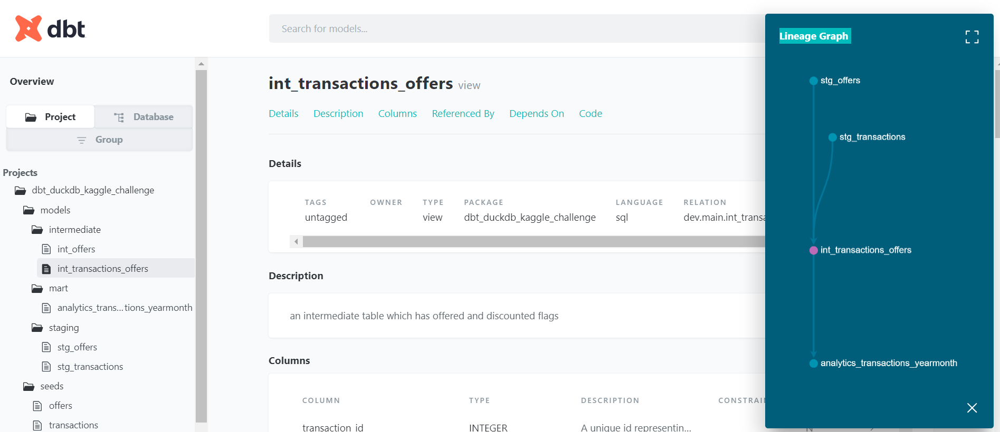
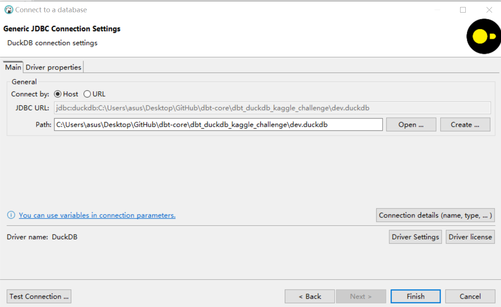

## Data pipeline: the integration of dbt with DuckDB

The DBT (data build tool) is a framework, which uses SQL as a syntax base, for processing/transforming analytical data. It focuses on the Transformation (T) step of the ETL (Extraction, Transformation and Load)

### What is DuckDB?
DuckDB is a relational embeddable analytical DBMS that focuses on supporting analytical query workloads (OLAP). Similar to SQLite, DuckDB prioritizes simplicity and ease of integration by eliminating external dependencies for compilation and run-time. 
[Why DuckDB ?](https://duckdb.org/why_duckdb.html)
DuckDB is designed to be embedded within applications or used as a serverless database. You can integrate it directly into your data pipeline without the need for a separate server installation or configuration. 

### Dependencies
- dbt core
- duckdb
- DBeaver (optional)

### Set up the project
- Create an isolated virtual environment for dbt-core
    ```
    conda create --name dbtenv python=3.11
    ```
- Activate the Environment
    ```
    conda activate dbtenv
    ```
- Install duckdb adapter
    ```
    pip install dbt-duckdb
    ```
### Run the project

- dbt seed
- dbt run
- dbt test
- dbt docs generate
- dbt docs serve

Data source reference:
https://www.kaggle.com/c/acquire-valued-shoppers-challenge/data?select=offers.csv.gz

### Verify the data using DBeaver IDE
- [Connect DuckDB to DBeaver](https://duckdb.org/docs/guides/sql_editors/dbeaver)

    
    The **Path** should the same as you defined in the profiles.yml or choose **Open** to browse up the directory.

### Resources:
- Learn more about dbt [in the docs](https://docs.getdbt.com/docs/introduction)
- Learn more about DuckDB [in the docs](https://duckdb.org/)
- Check out [the blog](https://blog.getdbt.com/) for the latest news on dbt's development and best practices
